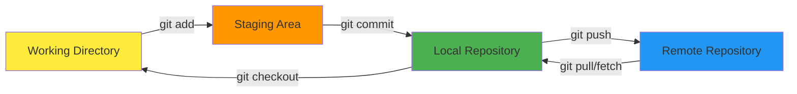
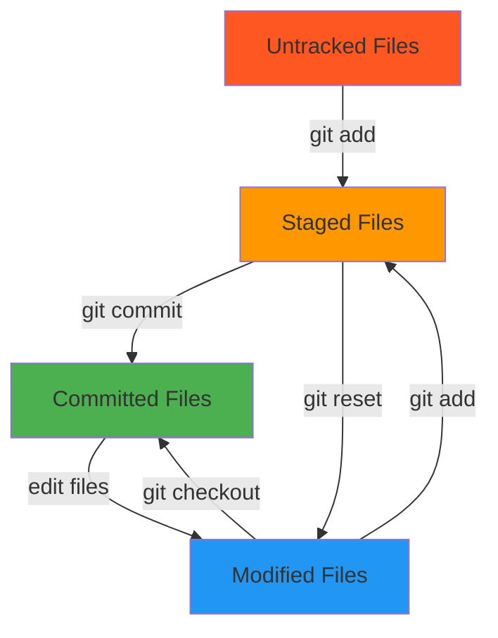
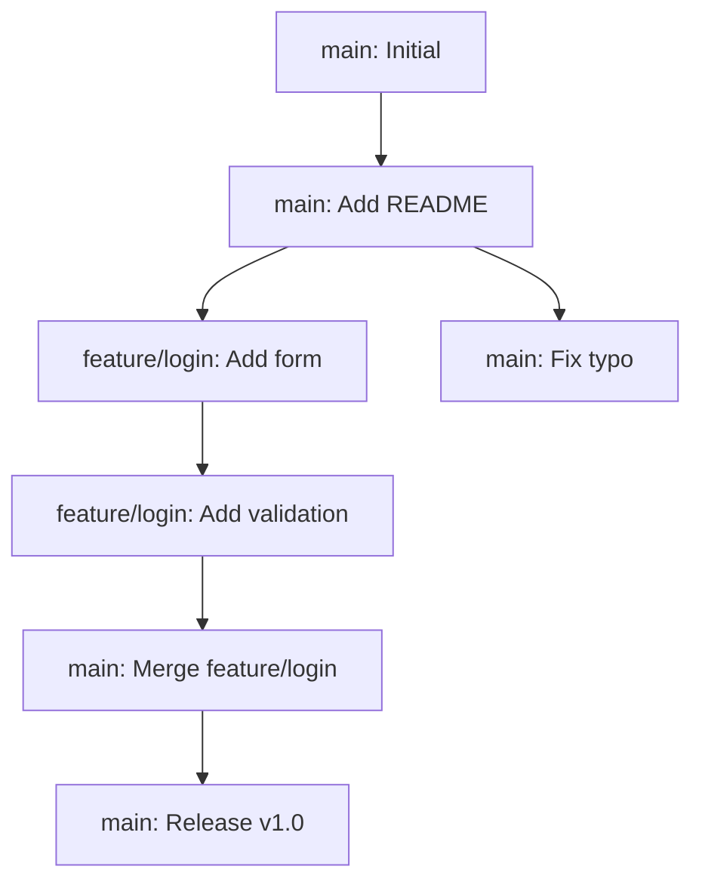
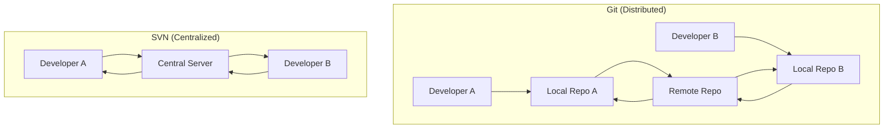

<div class="mt-5" />

# Introduction to Git

**Version Control Made Simple**

<div class="pt-12">
  <span @click="$slidev.nav.next" class="px-2 py-1 rounded cursor-pointer" hover:bg="white op-10">
    Let's dive in! <carbon:arrow-right class="inline"/>
  </span>
</div>

<div class="abs-br m-6 flex gap-2">
  <button @click="$slidev.nav.openInEditor()" title="Open in Editor" class="text-xl slidev-icon-btn opacity-50 hover:opacity-100">
    <carbon:edit />
  </button>
  <a href="https://github.com/git/git" target="_blank" alt="Git Repository" title="Git Repository" class="text-xl slidev-icon-btn opacity-50 hover:opacity-100">
    <carbon:logo-github />
  </a>
</div>

---


<div class="mt-5" />

# What is Git?

Git is a **distributed version control system** that tracks changes in files and coordinates work among multiple people.

<v-clicks>

- 🗂️ **Track Changes** - Keep a complete history of your project
- 🤝 **Collaborate** - Work with others without conflicts
- 🔄 **Branching** - Experiment safely with parallel development
- 🛡️ **Backup** - Never lose your work again
- ⚡ **Fast** - Designed for speed and efficiency
- 🌐 **Distributed** - Every copy is a complete backup

</v-clicks>

<br>

<v-click>

Created by **Linus Torvalds** in 2005 for Linux kernel development, Git has become the standard for version control across the software industry.

</v-click>

---
layout: two-cols
layoutClass: gap-16
---


<div class="mt-5" />

# Why Use Version Control?

<v-clicks>

**Without Git:**

- `final_project.docx`
- `final_project_v2.docx`
- `final_project_FINAL.docx`
- `final_project_FINAL_REALLY.docx`
- `final_project_DONT_TOUCH.docx`

**Problems:**

- Which is the latest?
- What changed between versions?
- How to merge team changes?
- Lost work when files get corrupted

</v-clicks>

::right::

<v-clicks>

**With Git:**

- Single project folder
- Complete change history
- Meaningful commit messages
- Easy collaboration
- Automatic merging
- Branch experiments

**Benefits:**

- Track who changed what and when
- Revert to any previous state
- Work simultaneously without conflicts
- Experiment safely with branches

</v-clicks>

---


<div class="mt-5" />

# Git Workflow Overview

<div class="mt-8">



</div>

<v-clicks>

- **Working Directory**: Your current files
- **Staging Area**: Changes ready to commit
- **Local Repository**: Your version history
- **Remote Repository**: Shared repository (GitHub, GitLab, etc.)

</v-clicks>

---


<div class="mt-5" />


# Essential Git Commands

<div class="grid grid-cols-2 gap-8 mt-8">

<div>

## Repository Setup

```bash
# Initialize a new repository
git init
# Clone existing repository
git clone <url>
# Check repository status
git status
```

## Making Changes

```bash
# Add files to staging
git add <file>
git add .
# Commit changes
git commit -m "message"
# View commit history
git log
```

</div>

<div>

## Remote Operations

```bash
# Add remote repository
git remote add origin <url>
# Push changes
git push origin main
# Pull latest changes
git pull origin main
# Fetch without merging
git fetch
```

## Branching

```bash
# Create new branch
git branch <name>
# Switch branches
git checkout <branch>
# Create and switch
git checkout -b <branch>
```

</div>

</div>

---


---
layout: default
---


# Your First Git Repository

Let's create your first repository step by step:

<div class="overflow-y-auto max-h-[60vh] mt--10">

<v-clicks>

- **Initialize the repository**

  ```bash
  mkdir my-first-repo
  cd my-first-repo
  git init
  ```

- **Create your first file**

  ```bash
  echo "# My First Project" > README.md
  ```

- **Add and commit**

  ```bash
  git add README.md
  git commit -m "Initial commit: Add README"
  ```

- **Check what happened**

  ```bash
  git log --oneline
  git status
  ```

</v-clicks>
</div>

---


<div class="mt-5" />

# Understanding Git States

<div class="mt-8">



</div>

<v-clicks>

- **Untracked**: New files Git doesn't know about
- **Staged**: Changes ready for the next commit
- **Committed**: Changes saved in repository history
- **Modified**: Changes made but not staged yet

</v-clicks>


---
layout: two-cols
layoutClass: gap-16
---


<div class="mt-5" />

# Branching Concepts

Branches allow parallel development:

<v-clicks>

```bash
# Create feature branch
git checkout -b feature/login
# Work on feature...
git add .
git commit -m "Add login form"
# Switch back to main
git checkout main
# Merge feature
git merge feature/login
```

**Why use branches?**

- Isolate features/experiments
- Collaborate without conflicts
- Review before merging
- Keep main branch stable

</v-clicks>

::right::

<v-click>

<div class="overflow-y-auto max-h-[60vh] mt--5">
  <v-click>


</v-click>
</div>

</v-click>

---


<div class="mt-5" />

# Remote Repositories

Connect your local repository to remote services like GitHub:

<div class="overflow-y-auto max-h-[60vh] mt--5">
<v-clicks>

1. **Create repository on GitHub**
  ```bash
   - Go to github.com → New repository
   - Choose name and settings
   - Copy the repository URL
  ```
2. **Connect local to remote**

   ```bash
   git remote add origin https://github.com/username/repo.git
   git branch -M main
   git push -u origin main
   ```

3. **Daily workflow**
   ```bash
   git pull origin main    # Get latest changes
   # ... make changes ...
   git add .
   git commit -m "Description"
   git push origin main    # Share your changes
   ```

</v-clicks>


</div>

---


<div class="mt-5" />

# Handling Merge Conflicts

When Git can't automatically merge changes:

<div class="overflow-y-auto max-h-[60vh] mt--5">

<v-clicks>

**Conflict example:**

```txt
< < < HEAD
console.log("Hello from main branch");
= = =
console.log("Hello from feature branch");
> > > feature-branch
```

**Resolution steps:**

1. **Identify conflicts** - Git marks them in files
2. **Edit files** - Choose which changes to keep
3. **Remove markers** - Delete conflict indicators
4. **Stage resolved files** - `git add conflicted-file.js`
5. **Complete merge** - `git commit`


</v-clicks>
</div>

---


<div class="mt-5" />

# Best Practices

<div class="grid grid-cols-2 gap-8 mt--2">

<div>

## Commit Messages

<v-clicks>

✅ **Good commits:**

```
Add user authentication system
Fix memory leak in data processor
Update README with installation steps
```

❌ **Bad commits:**

```
fix
updated stuff
asdf
```

</v-clicks>

</div>

<div>

## General Guidelines

<v-clicks>

- **Commit often** - Small, logical changes
- **Write clear messages** - Explain what and why
- **Use branches** - Keep main stable
- **Review before merging** - Use pull requests
- **Keep history clean** - Avoid unnecessary merges
- **Use .gitignore** - Don't track generated files

</v-clicks>

</div>

</div>

<v-click>

### Commit Message Format

```
<type>: <subject>

```

**Types:** feat, fix, docs, style, refactor, test, chore

</v-click>

---


<div class="mt-5" />

# Essential .gitignore

Always ignore files that shouldn't be tracked:

```bash
# Dependencies
node_modules/
venv/
.env

# Build outputs
dist/
build/
*.exe
*.o


# IDE files
.vscode/
.idea/
*.swp


# OS generated
.DS_Store
Thumbs.db


# Logs
*.log
logs/


# Temporary files
*.tmp
*.temp
```

<v-click>

**Pro tip:** Use [gitignore.io](https://gitignore.io) to generate .gitignore files for your technology stack!

</v-click>

---


<div class="mt-5" />

# Useful Git Commands

<div class="grid grid-cols-2 gap-8 mt-6">

<div>

## History & Information

```bash
# View commit history
git log --oneline --graph
# Show changes in commit
git show <commit-hash>
# View file history
git log -p <filename>
# See who changed what
git blame <filename>
# Find commits by message
git log --grep="bug fix"
```

</div>

<div>

## Undoing Changes

```bash
# Undo unstaged changes
git checkout -- <filename>
# Unstage files
git reset HEAD <filename>
# Undo last commit (keep changes)
git reset --soft HEAD~1
# Undo last commit (discard changes)
git reset --hard HEAD~1
# Create new commit that undoes
git revert <commit-hash>
```

  </div>

  </div>

---


<div class="mt-5" />

# Git Hosting Platforms

<div class="grid grid-cols-3 gap-8 mt-8">

<div class="text-center">

### GitHub

<div class="text-6xl mx-auto mb-4">🐙</div>

- **Most popular**
- Free public/private repos
- Great for open source
- Excellent CI/CD integration
- Strong community features

</div>

<div class="text-center">

### GitLab

<div class="text-6xl mx-auto mb-4">🦊</div>

- **DevOps focused**
- Built-in CI/CD
- Self-hosted options
- Integrated project management
- Strong enterprise features

</div>

<div class="text-center">

### Bitbucket

<div class="text-6xl mx-auto mb-4">🪣</div>

- **Atlassian ecosystem**
- Integrates with Jira
- Good for teams using Atlassian
- Unlimited private repos
- Built-in CI/CD

</div>

</div>

---
layout: two-cols
layoutClass: gap-16
---


<div class="mt-5" />

# Git vs Other VCS

<v-clicks>

**Git Advantages:**

- Distributed (every clone is complete)
- Incredibly fast
- Excellent branching/merging
- Strong community support
- Industry standard

**Centralized VCS (SVN, Perforce):**

- Single point of failure
- Requires server connection
- Limited offline capabilities
- Simpler model for some teams

</v-clicks>

::right::

<v-click>

**Git vs SVN Workflow:**



</v-click>

---


<div class="mt-5" />

# Advanced Git Features

<div class="grid grid-cols-2 gap-8 mt-6">

<div>

## Git Stash

<v-clicks>

Temporarily save uncommitted changes:

```bash
# Save current changes
git stash
# Apply latest stash
git stash pop
# List all stashes
git stash list
# Apply specific stash
git stash apply stash@{1}
```

**Use cases:**

- Quick branch switching
- Pulling with uncommitted changes
- Temporary experiments

</v-clicks>

</div>

<div>

## Git Tags

<v-clicks>

Mark important points in history:

```bash
# Create lightweight tag
git tag v1.0.0
# Create annotated tag
git tag -a v1.0.0 -m "Version 1.0"
# Push tags to remote
git push origin --tags
# List tags
git tag -l
```

**Use cases:**

- Release versions
- Milestones
- Deployment markers

</v-clicks>

</div>

</div>

---


<div class="mt-5" />

# Git Aliases & Configuration

Make Git more convenient with aliases:

<v-clicks>

```bash
# Set up useful aliases
git config --global alias.st status
git config --global alias.co checkout
git config --global alias.br branch
git config --global alias.ci commit
git config --global alias.unstage 'reset HEAD --'
git config --global alias.last 'log -1 HEAD'
git config --global alias.visual '!gitk'
# Configure your identity
git config --global user.name "Your Name"
git config --global user.email "your.email@st-andrews.ac.uk"
# Set default editor
git config --global core.editor "code --wait"
# Enable colored output
git config --global color.ui auto
```

Now you can use `git st` instead of `git status`!

</v-clicks>

---


<div class="mt-5" />

# Common Git Mistakes & Solutions

<div class="grid grid-cols-2 gap-6 mt-6">

<div>

### Mistake: Wrong commit message

```bash
# Fix last commit message
git commit --amend -m "Correct message"
```

### Mistake: Forgot to add file

```bash
# Add file to last commit
git add forgotten-file.txt
git commit --amend --no-edit
```

### Mistake: Committed to wrong branch

```bash
# Move commits to new branch
git checkout -b correct-branch
git checkout wrong-branch
git reset --hard HEAD~1
```

  </div>

<div>

### Mistake: Accidentally deleted file

```bash
# Restore from last commit
git checkout HEAD -- deleted-file.txt
```

### Mistake: Want to uncommit changes

```bash
# Keep changes but uncommit
git reset --soft HEAD~1
# Discard changes and uncommit
git reset --hard HEAD~1
```

### Mistake: Merge conflict panic

```bash
# Abort merge and start over
git merge --abort
```

</div>

</div>


<div class="mt-5" />

# Let's Practice!

<div class="text-left max-w-2xl mx-auto">

## Quick Exercise

<v-clicks>

1. **Create a new repository** for a simple project
2. **Add some files** (README.md, index.html, style.css)
3. **Make several commits** with good messages
4. **Create a feature branch** and add a new feature
5. **Merge back to main** and handle any conflicts
6. **Push to GitHub** and explore the interface

</v-clicks>

<v-click>

### Remember:

- **Start small** - Master basics before advanced features
- **Practice regularly** - Git becomes second nature
- **Don't fear mistakes** - Almost everything is recoverable
- **Use GUI tools** if needed (GitKraken, SourceTree, VS Code)

</v-click>

</div>

---

---


<div class="mt-5" />

# Additional Resources

<div class="grid grid-cols-2 gap-8 mt-8">

<div>

## Learning Resources

- **[Pro Git Book](https://git-scm.com/book)** - Free, comprehensive guide
- **[GitHub Learning Lab](https://lab.github.com/)** - Interactive tutorials
- **[Atlassian Git Tutorials](https://www.atlassian.com/git/tutorials)** - Excellent explanations
- **[Oh Shit, Git!](https://ohshitgit.com/)** - Fix common mistakes
- **[Learn Git Branching](https://learngitbranching.js.org/)** - Visual interactive tutorial

## Tools & GUIs

- **[GitHub Desktop](https://desktop.github.com/)** - Simple GUI
- **[GitKraken](https://www.gitkraken.com/)** - Powerful visual client
- **[SourceTree](https://www.sourcetreeapp.com/)** - Free Atlassian GUI
- **VS Code** - Built-in Git support

</div>

<div>

## Cheat Sheets

- **[Git Cheat Sheet](https://education.github.com/git-cheat-sheet-education.pdf)** - GitHub's official
- **[Atlassian Cheat Sheet](https://www.atlassian.com/git/tutorials/atlassian-git-cheatsheet)** - Comprehensive reference

## University Resources

- **St Andrews GitLab** - Internal code hosting
- **Computing Support** - Help with setup
- **CS Department** - Advanced workshops
- **Library Digital Skills** - Version control workshops

## Practice Platforms

- **[Codecademy Git Course](https://www.codecademy.com/learn/learn-git)**
- **[Katacoda Git Scenarios](https://katacoda.com/courses/git)**

</div>

</div>
---


---
layout: center
class: text-center
---


# Thank You!

## Questions & Discussion

Git is a powerful tool that becomes easier with practice.  
Start using it for your projects, and don't hesitate to experiment!

<br>

University of St Andrews  
Introduction to Git Workshop

<br>

[Git Official Website](https://git-scm.com/)
